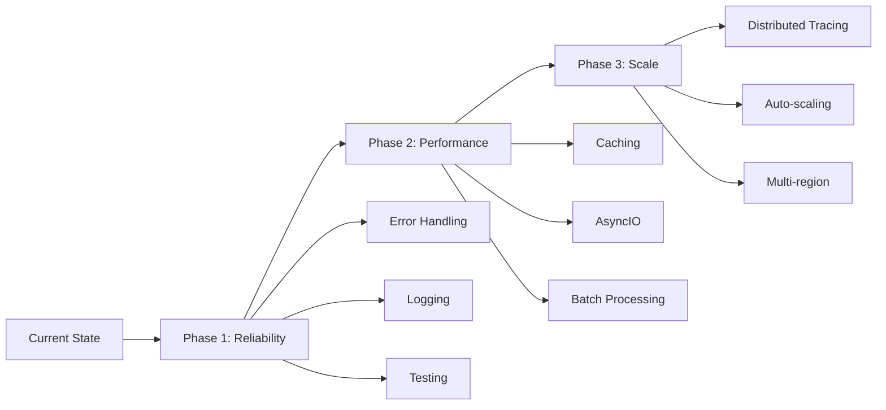

# 🎯 JD Recommendation System - Comprehensive Architecture Review

> 作者: Senior AI Engineer review  
> 日期: 2025-12-29  
> 評價者: AI với chuyên môn về LangChain/LangGraph

---

## 📋 Executive Summary

Repo của bạn cho thấy một hệ thống **well-structured** với kiến trúc rõ ràng, sử dụng các công nghệ hiện đại và áp dụng nhiều best practices trong AI/ML engineering. Tuy nhiên, vẫn còn một số điểm có thể cải thiện để tăng scalability, maintainability và performance.

**Overall Grade: B+ (Good with room for improvement)**

---

## 🏗️ Architecture Analysis

### 1. **Chatbot Module - LangChain/LangGraph Implementation**

#### ✅ **Strengths (Điểm mạnh)**

1. **Clean Agent Architecture**
   - Sử dụng `Orchestrator` pattern để quản lý LangGraph - đây là best practice ✓
   - Tách biệt rõ ràng các agents (Resume, JD, Retrieval, Evaluation) theo Single Responsibility Principle
   - State management đúng chuẩn với TypedDict và CompiledStateGraph

2. **LLM Provider Abstraction**
   - Factory pattern ([llm_factory.py](file:///c:/Git/Zectier/jd-recommendation-system/apps/chatbot/core/factories/llm_factory.py)) tốt, hỗ trợ nhiều providers (Gemini, Groq, Bedrock)
   - TypedDict cho config giúp type safety tốt hơn
   - Flexible configuration với Required và NotRequired fields

3. **Structured Output với Pydantic**
   - Schema definitions rất tốt ([resume.py](file:///c:/Git/Zectier/jd-recommendation-system/apps/chatbot/schema/resume.py), [jd.py](file:///c:/Git/Zectier/jd-recommendation-system/apps/chatbot/schema/jd.py))
   - Field descriptions chi tiết giúp LLM hiểu rõ output format
   - Nested models (Experience) được sử dụng đúng cách

4. **Vector Retrieval System**
   - Sử dụng ChromaDB với Bedrock embeddings - production-grade choice
   - Có scoring mechanism (`similarity_search_with_score`)
   - Match percentage calculation để user-friendly

#### ⚠️ **Vấn đề cần cải thiện**

1. **Error Handling & Logging**

```python
# ❌ BAD - From resume_extract_agent.py
except Exception as e:
    resume_content = ""
    self.logger.error(f"Error while processing extract resume: {e}")
    # Không raise exception, có thể gây silent failure
```

**Recommendation:**
```python
# ✅ GOOD
from typing import Optional
import traceback

class ResumeExtractAgent:
    def extract_resume(self, resume_path: str) -> dict:
        try:
            if "docx" in resume_path.split("."):
                content = docx_loader.invoke(resume_path)
            elif "pdf" in resume_path.split("."):
                content = pdf_loader.invoke(resume_path)
            else:
                raise ValueError(f"Unsupported file type: {resume_path}")
        except FileNotFoundError:
            self.logger.error(f"File not found: {resume_path}")
            raise
        except Exception as e:
            self.logger.error(
                f"Error processing resume: {e}\\n{traceback.format_exc()}"
            )
            raise RuntimeError(f"Failed to extract resume from {resume_path}") from e
```

2. **State Management & Validation**

```python
# ❌ CURRENT - orchestrator.py
def jd_node(state: State):
    jd_path = state.get("jd_path")
    if not jd_path:
        raise ValueError("jd_path is missing in state")
```

**Recommendation - Sử dụng Pydantic validator:**
```python
from pydantic import BaseModel, field_validator

class State(BaseModel):
    resume_path: str
    jd_path: str
    resume_text: Optional[Resume] = None
    jd_text: Optional[JD] = None
    messages: List[str] = []
    retrieved_jobs: List[str] = []
    
    @field_validator('resume_path', 'jd_path')
    def validate_paths(cls, v):
        if not v:
            raise ValueError("Path cannot be empty")
        if not os.path.exists(v):
            raise FileNotFoundError(f"File not found: {v}")
        return v
```

3. **Retrieval Agent - Query Construction**

```python
# ⚠️ CURRENT - retrieval_agent.py (trong orchestrator)
# Query construction logic phức tạp nhưng nằm trong orchestrator
query_parts = []
if hasattr(resume_text, "hard_skills") and resume_text.hard_skills:
    skills_str = ", ".join(resume_text.hard_skills)
    query_parts.append(f"Skills: {skills_str}")
```

**Recommendation - Move to RetrievalAgent:**
```python
class RetrievalAgent(BaseAgent):
    def build_query_from_resume(self, resume: Resume) -> str:
        """Build optimized query from resume for retrieval"""
        query_parts = []
        
        # Skills weighted higher
        if resume.hard_skills:
            query_parts.append(f"Skills: {', '.join(resume.hard_skills[:5])}")  # Top 5
        
        # Years of experience
        if resume.years_of_experience > 0:
            query_parts.append(f"Experience: {resume.years_of_experience} years")
            
        # Profile summary (truncated)
        if resume.profile_summary:
            summary = resume.profile_summary[:200]  # Limit length
            query_parts.append(f"Profile: {summary}")
            
        return "\\n".join(query_parts)
    
    def retrieve(self, query: str, k: int = 5) -> List[Dict[str, Any]]:
        docs_with_scores = self.vectorstore.similarity_search_with_score(query, k=k)
        
        return [
            {
                "content": doc.page_content,
                "metadata": doc.metadata,
                "score": 1 / (1 + distance),
                "match_percentage": (1 / (1 + distance)) * 100
            }
            for doc, distance in docs_with_scores
        ]
```

4. **Chưa có Caching & Rate Limiting**

```python
# ✅ RECOMMENDATION - Thêm LRU cache cho LLM calls
from functools import lru_cache
import hashlib

class ResumeExtractAgent:
    def _cache_key(self, content: str) -> str:
        return hashlib.md5(content.encode()).hexdigest()
    
    @lru_cache(maxsize=100)
    def extract_resume_cached(self, content_hash: str, content: str):
        """Cache extracted resumes to avoid redundant LLM calls"""
        chain = self.prompt | self.llm.with_structured_output(Resume)
        return chain.invoke({"resume_content": content})
```

5. **Missing Observability**

Chưa có:
- LangSmith tracing/monitoring
- Metrics collection (latency, token usage, costs)
- Structured logging

**Recommendation:**
```python
# ✅ Add LangSmith tracing
import os
os.environ["LANGCHAIN_TRACING_V2"] = "true"
os.environ["LANGCHAIN_API_KEY"] = "your-api-key"
os.environ["LANGCHAIN_PROJECT"] = "jd-recommendation"

# ✅ Add metrics
from datetime import datetime
from typing import Dict, Any

class MetricsCollector:
    def __init__(self):
        self.metrics = []
    
    def log_llm_call(self, agent: str, model: str, tokens: int, latency: float, cost: float):
        self.metrics.append({
            "timestamp": datetime.now().isoformat(),
            "agent": agent,
            "model": model,
            "tokens": tokens,
            "latency_ms": latency * 1000,
            "cost_usd": cost
        })
```

---

### 2. **Data Pipeline - Kafka, Airflow, Spark**

#### ✅ **Strengths**

1. **Incremental Processing**
   - Kafka producer ([producer.py](file:///c:/Git/Zectier/jd-recommendation-system/apps/crawler/kafka/producer.py)) có checkpoint mechanism (processed_urls.txt)
   - Chỉ gửi new records, tránh duplicate processing

2. **Docker Orchestration**
   - Docker Compose setup rõ ràng với separation of concerns
   - Health checks cho postgres
   - Volume mounts đúng cách

#### ⚠️ **Issues & Recommendations**

1. **Kafka Producer - Error Handling**

```python
# ❌ CURRENT
except Exception as e:
    print(f"Error creating topics: {e}")
```

**Recommendation:**
```python
# ✅ Better error handling
import logging
from kafka.errors import KafkaError

logging.basicConfig(level=logging.INFO)
logger = logging.getLogger(__name__)

def create_topics():
    try:
        admin_client = KafkaAdminClient(...)
        admin_client.create_topics(new_topics=topic_list)
        logger.info("Topics created successfully")
    except TopicAlreadyExistsError:
        logger.info("Topics already exist - skipping creation")
    except KafkaError as e:
        logger.error(f"Kafka error: {e}", exc_info=True)
        raise  # Re-raise to fail fast
    except Exception as e:
        logger.error(f"Unexpected error: {e}", exc_info=True)
        raise
```

2. **JSONL vs JSON cho ITViec**

```python
# ⚠️ CURRENT - Mixed formats
topcv_raw = load_json(topcv_path)  # JSON
itviec_list = load_jsonl(itviec_path)  # JSONL
```

**Recommendation - Standardize:**
```python
# ✅ Unified format
def load_job_data(path: str, format: str = "auto") -> List[Dict]:
    """Auto-detect or explicit format loading"""
    if format == "auto":
        format = "jsonl" if path.endswith(".jsonl") else "json"
    
    if format == "jsonl":
        return load_jsonl(path)
    else:
        data = load_json(path)
        # Normalize: always return list
        if isinstance(data, dict) and "jobs" in data:
            return data["jobs"]
        return data if isinstance(data, list) else [data]
```

3. **Airflow DAGs - Chưa thấy implementation**

Cần review Airflow DAGs để đảm bảo:
- Proper task dependencies
- Retry logic & alerting
- SLA monitoring

4. **Spark Jobs - Chưa được review**

Cần check:
- Checkpoint strategy
- Backpressure handling
- Resource allocation

---

### 3. **Frontend - React/TypeScript**

#### ✅ **Positive Signs**

1. Modern tech stack: React, TypeScript, Vite, shadcn/ui
2. Type safety với TypeScript
3. Design system với Radix UI components

#### ⚠️ **Concerns (Cần xem code để confirm)**

1. Chưa thấy API integration code
2. Chưa có state management strategy visible (React Query đã có trong deps)
3. Server-side rendering setup với Express

---

## 📊 Evaluation Results Review

File [retrieval_evaluation.json](file:///c:/Git/Zectier/jd-recommendation-system/apps/chatbot/evaluation/results/retrieval_evaluation.json):

```json
{
  "metrics": {
    "exact_hit_rate": "45/50 (90.00%)"
  }
}
```

### ✅ **Excellent Performance!**

- **90% exact hit rate** là rất cao cho RAG system
- Cho thấy:
  - Embedding model quality tốt
  - Query construction effective
  - Chunking strategy phù hợp

### 💡 **Suggestions for Better Evaluation**

```python
# ✅ Thêm nhiều metrics hơn
evaluation_metrics = {
    "exact_hit_rate": "45/50 (90.00%)",
    "mrr": 0.92,  # Mean Reciprocal Rank
    "ndcg@5": 0.88,  # Normalized Discounted Cumulative Gain
    "precision@5": 0.85,
    "recall@5": 0.80,
    "latency_p50": "120ms",
    "latency_p95": "350ms",
    "latency_p99": "650ms"
}
```

---

## 🎯 Best Practices Assessment

### ✅ **What You're Doing Right**

1. ✓ **Separation of Concerns** - Agents, schemas, tools tách biệt
2. ✓ **Type Safety** - Pydantic schemas, TypedDict
3. ✓ **Factory Pattern** - LLM provider abstraction
4. ✓ **Graph-based Orchestration** - LangGraph cho complex workflows
5. ✓ **Evaluation-Driven** - Có systematic evaluation
6. ✓ **Incremental Processing** - Checkpoint mechanism
7. ✓ **Modern Tech Stack** - AWS Bedrock, ChromaDB, Kafka

### ⚠️ **Areas for Improvement**

| Category | Issue | Priority | Impact |
|----------|-------|----------|--------|
| **Error Handling** | Silent failures, broad exception catching | 🔴 HIGH | Production reliability |
| **Observability** | No tracing, metrics, structured logging | 🔴 HIGH | Debugging & monitoring |
| **Caching** | No LLM result caching | 🟡 MEDIUM | Cost & latency |
| **Testing** | No visible unit tests | 🟡 MEDIUM | Code quality |
| **Documentation** | Minimal inline docs | 🟡 MEDIUM | Maintainability |
| **Rate Limiting** | No protection against rate limits | 🟢 LOW | Robustness |
| **Retry Logic** | Basic or missing retry strategies | 🟢 LOW | Resilience |

---

## 🚀 Optimization Recommendations

### 1. **Performance Optimization**

#### Batch Processing for Evaluation

```python
# ✅ Process evaluations in batches
from concurrent.futures import ThreadPoolExecutor
from typing import List, Dict

class EvaluationAgent:
    def evaluate_batch(
        self, 
        resume_jd_pairs: List[tuple[Resume, JD]], 
        max_workers: int = 5
    ) -> List[Dict]:
        """Parallel evaluation with thread pool"""
        with ThreadPoolExecutor(max_workers=max_workers) as executor:
            futures = [
                executor.submit(self.evaluate, resume, jd)
                for resume, jd in resume_jd_pairs
            ]
            return [f.result() for f in futures]
```

#### AsyncIO cho Vector Search

```python
# ✅ Async retrieval
import asyncio
from typing import List

class AsyncRetrievalAgent:
    async def retrieve_async(self, query: str, k: int = 5) -> List[Dict]:
        """Async wrapper for retrieval"""
        loop = asyncio.get_event_loop()
        docs = await loop.run_in_executor(
            None, 
            self.vectorstore.similarity_search_with_score, 
            query, 
            k
        )
        return self._format_results(docs)
    
    async def retrieve_multiple(self, queries: List[str]) -> List[List[Dict]]:
        """Batch retrieval with async"""
        tasks = [self.retrieve_async(q) for q in queries]
        return await asyncio.gather(*tasks)
```

### 2. **Scalability Improvements**

#### Streaming cho Large Documents

```python
# ✅ Stream processing
from langchain.text_splitter import RecursiveCharacterTextSplitter

class DocumentProcessor:
    def __init__(self):
        self.splitter = RecursiveCharacterTextSplitter(
            chunk_size=1000,
            chunk_overlap=200,
            separators=["\\n\\n", "\\n", ". ", " ", ""]
        )
    
    def process_large_resume(self, resume_path: str) -> List[Resume]:
        """Process large resumes in chunks"""
        content = self.load_document(resume_path)
        chunks = self.splitter.split_text(content)
        
        # Process chunks in parallel or sequentially
        results = []
        for chunk in chunks:
            result = self.extract_from_chunk(chunk)
            results.append(result)
        
        # Merge results
        return self.merge_resume_sections(results)
```

#### Database Connection Pooling

```python
# ✅ Connection pooling cho ChromaDB
from chromadb.config import Settings

class VectorStoreManager:
    def __init__(self):
        self.settings = Settings(
            chroma_db_impl="duckdb+parquet",
            persist_directory=config.CHROMA_PERSIST_DIR,
            anonymized_telemetry=False
        )
        self._client = None
    
    @property
    def client(self):
        """Lazy initialization with connection pooling"""
        if self._client is None:
            self._client = chromadb.Client(self.settings)
        return self._client
```

### 3. **Code Quality Enhancements**

#### Add Type Hints Everywhere

```python
# ✅ Complete type annotations
from typing import Dict, List, Optional, Tuple
from langchain_core.language_models.chat_models import BaseChatModel

class BaseAgent:
    def __init__(
        self, 
        name: str, 
        llm: BaseChatModel, 
        tools: List[Callable]
    ) -> None:
        self.name: str = name
        self.llm: BaseChatModel = llm
        self.tools: List[Callable] = tools
        self.logger: Logger = Logger(name)
```

#### Add Comprehensive Tests

```python
# ✅ Unit tests
import pytest
from unittest.mock import Mock, patch

@pytest.fixture
def mock_llm():
    llm = Mock(spec=BaseChatModel)
    llm.with_structured_output.return_value = Mock()
    return llm

@pytest.fixture
def resume_agent(mock_llm):
    return ResumeExtractAgent("test_agent", mock_llm, [])

def test_extract_resume_pdf(resume_agent, tmp_path):
    # Create temp PDF
    pdf_path = tmp_path / "test.pdf"
    pdf_path.write_text("Test resume content")
    
    with patch('tools.document_loader.pdf_loader') as mock_loader:
        mock_loader.invoke.return_value = "Resume text"
        
        result = resume_agent.extract_resume(str(pdf_path))
        
        assert "resume" in result
        mock_loader.invoke.assert_called_once()

def test_extract_resume_invalid_path(resume_agent):
    with pytest.raises(FileNotFoundError):
        resume_agent.extract_resume("/nonexistent/file.pdf")
```

### 4. **Configuration Management**

```python
# ✅ Centralized config with Pydantic
from pydantic_settings import BaseSettings
from typing import Optional

class Settings(BaseSettings):
    # LLM Settings
    groq_api_key: str
    groq_model: str = "llama-3.3-70b-versatile"
    bedrock_region: str = "us-east-1"
    bedrock_embedding_model: str = "amazon.titan-embed-text-v1"
    
    # Vector DB Settings
    chroma_persist_dir: str = "./chroma_db"
    chroma_collection_name: str = "job_descriptions"
    
    # Kafka Settings
    kafka_bootstrap_servers: str = "localhost:9092"
    
    # Observability
    langsmith_tracing: bool = False
    langsmith_api_key: Optional[str] = None
    log_level: str = "INFO"
    
    class Config:
        env_file = ".env"
        env_file_encoding = "utf-8"

# Singleton instance
settings = Settings()
```

---

## 📝 CRITICAL Improvements Summary

### 🔴 **Must Fix (Priority 1)**

1. **Error Handling & Logging**
   - Replace broad `except Exception` with specific exceptions
   - Add proper logging with context
   - Implement retry logic với exponential backoff

2. **Observability**
   - Enable LangSmith tracing
   - Add metrics collection (latency, costs, tokens)
   - Structured logging with correlation IDs

3. **State Validation**
   - Use Pydantic validators for State
   - Check file existence before processing
   - Validate LLM outputs

### 🟡 **Should Fix (Priority 2)**

4. **Testing**
   - Unit tests cho mỗi agent
   - Integration tests cho graph execution
   - Mock LLM calls để tests nhanh

5. **Performance**
   - LRU cache cho LLM results
   - Async retrieval
   - Batch processing

6. **Documentation**
   - Docstrings cho tất cả public methods
   - Architecture diagrams (đã có graph export, tốt!)
   - API documentation

### 🟢 **Nice to Have (Priority 3)**

7. **Advanced Features**
   - Streaming responses for long-running tasks
   - Webhook support cho async notifications
   - A/B testing framework

---

## 🎬 Kết luận

### 💪 **Điểm Mạnh Chính**

1. ✓ Architecture design tốt với clear separation
2. ✓ Modern tech stack và best practices cơ bản
3. ✓ Evaluation-driven development (90% hit rate!)
4. ✓ Production-ready components (ChromaDB, Bedrock, Kafka)

### 🎯 **Roadmap Cải Thiện**



### 📊 **Final Score**

| Category | Score | Notes |
|----------|-------|-------|
| Architecture | 8.5/10 | Excellent separation, LangGraph usage |
| Code Quality | 7.0/10 | Good but needs tests, better error handling |
| Performance | 7.5/10 | Good but can optimize (caching, async) |
| Scalability | 7.0/10 | Foundation solid, needs connection pooling |
| Observability | 5.0/10 | Missing tracing, metrics |
| Documentation | 6.0/10 | Có schemas tốt, thiếu docs |
| **Overall** | **7.2/10** | **Solid B+ with clear improvement path** |

---

## 📚 Resources & Next Steps

### Recommended Reading

1. [LangChain Best Practices](https://python.langchain.com/docs/guides/productionization/)
2. [LangSmith Tracing](https://docs.smith.langchain.com/)
3. [Pydantic V2 Migration](https://docs.pydantic.dev/latest/migration/)
4. [ChromaDB Production Guide](https://docs.trychroma.com/deployment)

### Action Items

- [ ] Implement proper error handling trong tất cả agents
- [ ] Add LangSmith tracing
- [ ] Write unit tests (target 70% coverage)
- [ ] Add LRU cache cho LLM calls
- [ ] Document API endpoints
- [ ] Set up monitoring dashboard (Grafana + Prometheus)
- [ ] Load testing với locust/k6

---

**Câu hỏi? Cần clarification về bất kỳ điểm nào?** 🚀
